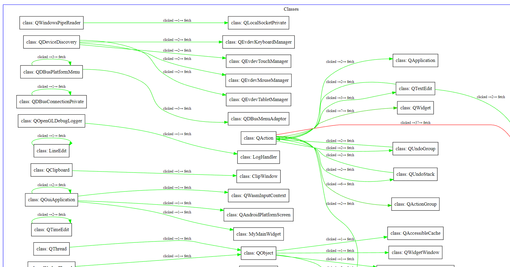
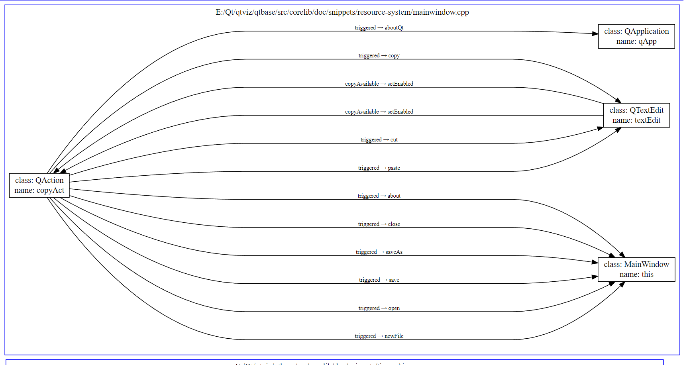

# QtViz

QtViz is a python library for visualizing Qt-signal/slot connections.
Pass the path as an argument to the main.py file to visualize the signal/slot connections of a specific project. All files with the extension .cpp and .h will be parsed (recursively).

The output will be a graphviz file (.dot), visualizing the signal/slot connections of the project on a class level and a file level.
## Class level
The class level visualization shows the signal/slot connections of classes within the project (class name duplicates are not supported!).
This allows you to see which classes are connected to each other and how many connections there are between them. The edge's color indicates how often a connection occurs between two classes with this signal/slot combination (linearly scaled from green to red).

## File level
The file level visualization shows the signal/slot connections within a file. This allows you to see which signals are connected to which slots within a file.

## Example

